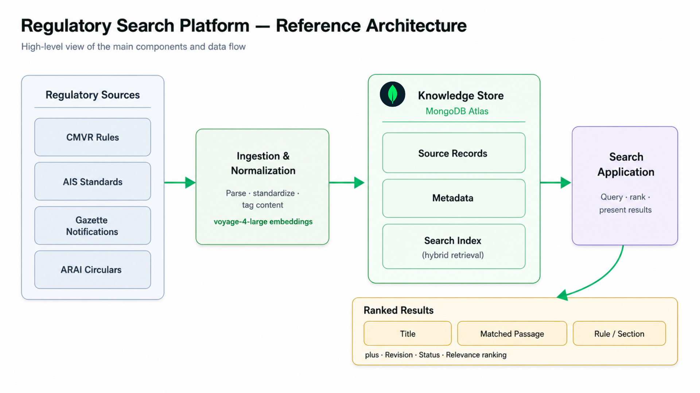
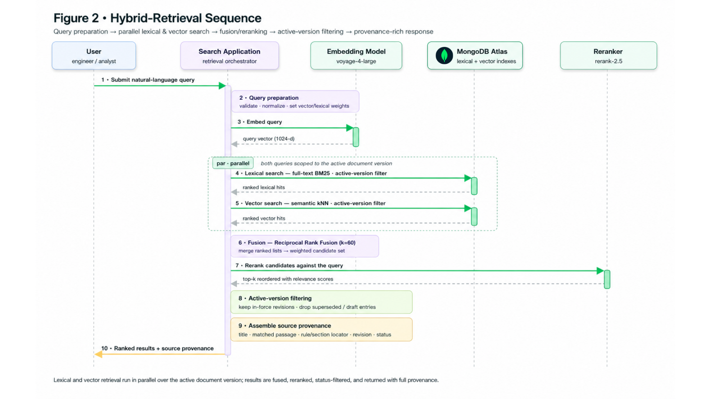
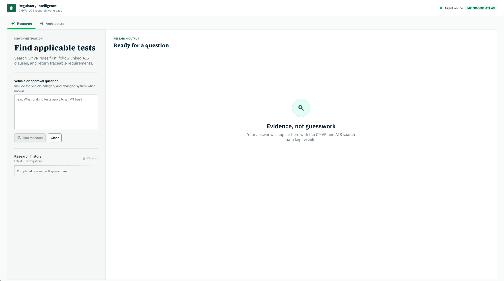
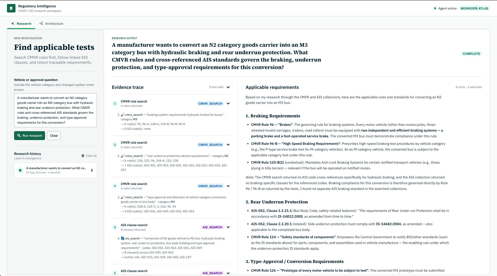

# CMVR + AIS Regulatory Search

A hybrid-search and agentic research assistant for Indian automotive type approval. It grounds answers in the primary regulatory sources — the **Central Motor Vehicle Rules (CMVR, 1989)** and the **Automotive Industry Standards (AIS)** — and returns cited, traceable results rather than an unsourced LLM summary.

The system pairs MongoDB lexical (full-text) search with MongoDB vector search over embeddings, fuses the two candidate sets with `$rankFusion`, applies regulatory-lifecycle filters, and reranks the survivors so that superseded or not-yet-effective passages are never presented as current law.



---

## Table of contents

- [Why this project](#why-this-project)
- [Key features](#key-features)
- [Architecture](#architecture)
- [App in action](#app-in-action)
- [Repository layout](#repository-layout)
- [Prerequisites](#prerequisites)
- [Configuration](#configuration)
- [Quick start](#quick-start)
- [How the pipeline works](#how-the-pipeline-works)
  - [1. Prepare the source corpus](#1-prepare-the-source-corpus)
  - [2. Normalize documents into searchable records](#2-normalize-documents-into-searchable-records)
  - [3. Create the hybrid-search indexes](#3-create-the-hybrid-search-indexes)
  - [4. Execute lexical and semantic retrieval](#4-execute-lexical-and-semantic-retrieval)
- [Running the application](#running-the-application)
- [Testing](#testing)
- [Data and provenance](#data-and-provenance)
- [Troubleshooting](#troubleshooting)

---

## Why this project

Compliance-style questions such as *“What tests apply to an M3 bus?”* cannot be answered acceptably with a vague model summary. The answer must be **correct** and it must **show where it came from**. This assistant is built around that constraint:

1. Search **CMVR** first.
2. Extract referenced **AIS codes**.
3. Search **AIS** using those codes as a strict filter.
4. Return a **traceable answer with citations**, including document identifier, revision, and effective date.

---

## Key features

- **Hybrid retrieval** — combines MongoDB full-text (lexical) search with MongoDB vector search over embeddings.
- **Regulatory lifecycle awareness** — records carry document state, revision, publication date, and effective date so superseded content is filtered out.
- **Reranking** — a cross-encoder rerank step reorders fused candidates by true relevance to the query.
- **Provenance-first results** — every result retains a link back to its source document and section.
- **Agentic workflow** — an orchestrated loop enforces the CMVR → AIS reasoning sequence and produces cited answers.
- **Multiple delivery surfaces** — a streaming FastAPI backend with a Next.js frontend, plus an optional Streamlit interface.

---

## Architecture

The Next.js frontend streams chat responses over SSE from the FastAPI backend, which runs the agentic loop and tool calls against MongoDB (lexical + vector search across `cmvr_rules`, `ais_rules`, and `research_history`) and the Voyage AI API for embeddings and reranking. See the reference architecture diagram above.

The hybrid-retrieval request path — query preparation, parallel lexical and vector search, fusion and reranking, active-version filtering, and the provenance-rich response — is shown below.



---

## App in action

Live run against the Next.js frontend and FastAPI backend for a multi-part conversion scenario: *"A manufacturer wants to convert an N2 category goods carrier into an M3 category bus with hydraulic braking and rear underrun protection. What CMVR rules and cross-referenced AIS standards govern the braking, underrun protection, and type-approval requirements for this conversion?"* The agent runs 7 tool calls across CMVR rule search and AIS clause search, then returns a structured, cited answer with the full evidence trace kept visible.



Final answer view:



---

## Repository layout

| Path | Purpose |
| --- | --- |
| **cmvr_agentic_ai/** | Main application package (config, search, agent, API, web UI). |
| **cmvr_agentic_ai/config.py** | Central settings and lazy MongoDB/Voyage handles. |
| **cmvr_agentic_ai/search/** | Retrieval pipeline: embeddings, lexical + vector search, hybrid fusion, reranking. |
| **cmvr_agentic_ai/db/** | Index creation and embedding backfill utilities. |
| **cmvr_agentic_ai/agent/** | LLM client, tool definitions, and the agentic loop. |
| **cmvr_agentic_ai/api.py** | Streaming FastAPI backend. |
| **cmvr_agentic_ai/web/** | Next.js frontend. |
| **ingest_regulatory_graph.py** | Corpus ingestion / graph building. |
| **rule_search.py** | Standalone rule-search entry point. |
| **extract_AIS.ipynb**, **extract_cmvr_rules_ais.ipynb** | Source-extraction notebooks. |
| **tests/** | Test suite. |
| **Makefile**, **RUNNING.md** | Run/automation reference. |

---

## Prerequisites

- **Python** 3.11+
- **Node.js** 18+ (for the Next.js frontend)
- **MongoDB** with vector-search support (Atlas or a compatible local deployment)
- API access to **Voyage AI** (embeddings + reranking)
- An LLM endpoint (OpenAI-compatible or the configured Grove gateway)

To follow the internals comfortably you should be familiar with FastAPI, React/Next.js, basic MongoDB, vector embeddings and hybrid search, and LLM tool calling.

---

## Configuration

Copy **.env.example** to `.env` and fill in the values:

```bash
cp .env.example .env
```

Core variables:

| Variable | Description | Default |
| --- | --- | --- |
| `MONGODB_URI` | MongoDB connection string | `mongodb://localhost:27017` |
| `MONGODB_DATABASE` | Database name | `automotive_regulations` |
| `CMVR_RULE_COLLECTION` | CMVR rules collection | `cmvr_rules` |
| `CMVR_TEXT_VECTOR_INDEX` | CMVR vector index name | `cmvr_rule_text_vector` |
| `CMVR_LEXICAL_INDEX` | CMVR full-text index name | `cmvr_rules_lexical` |
| `OPENAI_API_KEY` / `OPENAI_MODEL` | LLM credentials / model | — / `gpt-4.1-mini` |
| `VOYAGE_API_KEY` | Voyage AI key | — |
| `VOYAGE_EMBEDDING_MODEL` | Embedding model | `voyage-4-large` |
| `VOYAGE_RERANK_MODEL` | Rerank model | `rerank-2.5` |

> Embeddings are **1024-dimensional** with **cosine** similarity, matching the live `cmvr_rules` vectors. Keep these consistent across ingestion and index definitions.

---

## Quick start

```bash
# First-time setup (Python + Node dependencies)
make setup

# Run backend (:7860) and frontend (:3000) with live reload
make dev
```

See **RUNNING.md** and **MAKEFILE_REFERENCE.txt** for the full command set (`make backend`, `make frontend`, `make start-bg`, `make stop`, `make verify`, `make clean`).

---

## How the pipeline works

This is the end-to-end path from a raw regulatory source to a filtered, cited search result.

### 1. Prepare the source corpus

Collect the CMVR rule text, AIS standards, and the notifications or circulars that change their applicability. For each source, capture the original file or URL, document type, identifier, revision, publication date, effective date, and current lifecycle state.

**ingest_regulatory_graph.py** reads a regulatory PDF with Docling, chunks it hierarchically, and keeps structural parsing separate from the regulatory-context tracker (in the sampled CMVR/AIS PDFs, rules and clauses are not consistently classified as headings, so trusting heading metadata alone would attach chunks to the wrong rule):

```python
from docling.document_converter import DocumentConverter, PdfFormatOption
from docling_core.transforms.chunker import HierarchicalChunker

converter = DocumentConverter(
    format_options={InputFormat.PDF: PdfFormatOption(pipeline_options=PdfPipelineOptions())}
)
result = converter.convert(pdf_path)
if result.status != ConversionStatus.SUCCESS:
    raise RuntimeError(f"Docling conversion failed: {result.status}")

for chunk in HierarchicalChunker().chunk(result.document):
    # each chunk carries its text plus structural provenance (headings, page)
    process(chunk)
```

### 2. Normalize documents into searchable records

Extract rule- or section-level text, preserving the hierarchy required to identify a result in the original source. An LLM extraction step returns a strict, closed schema of graph nodes and edges so every record pairs searchable content with provenance and lifecycle metadata:

```python
class EntityModel(StrictExtractionModel):
    """A normalized graph node extracted from one structural chunk."""

    entity_id: str = Field(pattern=ENTITY_ID_PATTERN)
    name: str = Field(min_length=1, max_length=300)
    label: EntityLabel                       # Regulation | Standard | VehicleClass | Component
    properties: list[PropertyModel] = Field(default_factory=list)


class RelationshipModel(StrictExtractionModel):
    """A directed graph edge extracted from one structural chunk."""

    source_entity_id: str = Field(pattern=ENTITY_ID_PATTERN)
    target_entity_id: str = Field(pattern=ENTITY_ID_PATTERN)
    relation_type: RelationType              # MANDATES | APPLIES_TO | EXEMPTS | TESTED_BY
    properties: list[PropertyModel] = Field(default_factory=list)
```

AIS standards are normalized into flat, section-level records with the searchable `description` alongside `heading`, `subheading`, `rule`, and the cross-referenced `AIS` code:

```json
{
  "heading": "SCOPE",
  "heading_number": "1",
  "subheading": null,
  "rule": "1",
  "description": "This standard specifies installation requirements of interior and exterior rear view mirrors in Automotive vehicles.",
  "AIS": null
}
```

### 3. Create the hybrid-search indexes

Create a MongoDB Search index for exact identifiers and textual matching, and a MongoDB Vector Search index for the embedding field. **cmvr_agentic_ai/db/indexes.py** defines both idempotently. The lexical index uses the English analyzer for prose fields and `token` fields for exact code matching:

```python
SearchIndexModel(
    name=config.AIS_LEXICAL_INDEX,
    definition={
        "mappings": {
            "dynamic": False,
            "fields": {
                "description": {"type": "string", "analyzer": "lucene.english"},
                "heading": {"type": "string", "analyzer": "lucene.english"},
                "subheading": {"type": "string", "analyzer": "lucene.english"},
                # token fields power exact code matching via `equals`.
                "AIS_id": {"type": "token"},
                "AIS": {"type": "token"},
            },
        }
    },
)
```

The vector index declares the embedding path, dimensions, cosine similarity, and a filter field:

```python
SearchIndexModel(
    name=config.AIS_TEXT_VECTOR_INDEX,
    type="vectorSearch",
    definition={
        "fields": [
            {
                "type": "vector",
                "path": config.AIS_TEXT_VECTOR_FIELD,      # descriptionEmbedding
                "numDimensions": config.EMBEDDING_DIMENSION,  # 1024
                "similarity": "cosine",
            },
            {"type": "filter", "path": "AIS_id"},
        ]
    },
)
```

### 4. Execute lexical and semantic retrieval

For a user query, retrieve keyword candidates and vector candidates, then fuse them with a single MongoDB `$rankFusion` stage and rerank the survivors with Voyage AI. **cmvr_agentic_ai/search/hybrid.py** defines the fusion once for both the CMVR and AIS tools:

```python
pipeline = [
    {
        "$rankFusion": {
            "input": {
                "pipelines": {
                    "vector": vector_pipeline,   # $vectorSearch over the embedding field
                    "lexical": text_pipeline,    # $search over analyzed + token fields
                }
            },
            "combination": {
                "weights": {"vector": vector_weight, "lexical": text_weight},
            },
        }
    },
    {"$limit": limit},
    {"$project": projection},   # provenance fields: rule number, title, AIS codes, text
]
candidates = list(collection.aggregate(pipeline))

# Rerank the fused candidates against the query and keep the top-k.
documents = [rerank_text(doc)[: config.MAX_RERANK_DOCUMENT_CHARS] for doc in candidates]
hits = rerank.rerank(query, documents, top_k=rerank_top_k)
```

The `cmvr_search` tool applies this pipeline over `cmvr_rules`, boosts title matches, softly biases toward the requested vehicle category, and returns the union of AIS codes cross-referenced by the matched rules so the agent can continue the CMVR → AIS sequence:

```python
docs = hybrid_rerank(
    config.cmvr_collection(),
    query=effective_query,
    query_vector=query_vector,
    vector_index=config.CMVR_TEXT_VECTOR_INDEX,
    vector_path=config.CMVR_TEXT_VECTOR_FIELD,
    text_search_stage={
        "index": config.CMVR_LEXICAL_INDEX,
        "compound": {"should": should, "minimumShouldMatch": 1},
    },
    projection=_PROJECTION,
    rerank_text=_rerank_text,
    rerank_top_k=top_k,
)
return {"rules": rules, "ais_codes": sorted(all_codes)}
```

---

## Running the application

| Task | Command |
| --- | --- |
| Install dependencies | `make setup` |
| Dev mode (both services) | `make dev` |
| Backend only | `make backend` |
| Frontend only | `make frontend` |
| Background mode | `make start-bg` |
| Stop services | `make stop` |
| Verify services | `make verify` |
| List all commands | `make help` |

Service URLs once running:

- Frontend: <http://localhost:3000>
- Backend API: <http://localhost:7860>
- Health check: <http://localhost:7860/api/health>

---

## Testing

```bash
# Run the full suite
python -m pytest

# Run a specific module
python -m pytest tests/test_rule_search.py
```

Existing tests live in **tests/**:
`test_rule_search.py` and `test_ingest_regulatory_graph.py`.

---

## Troubleshooting

- **Port already in use (7860 / 3000):** run `make stop`, then restart.
- **Dependencies missing:** re-run `make setup` (or `make install`).
- **MongoDB connection errors:** verify `MONGODB_URI` and that the cluster/instance is reachable; `config.py` pings the server on first connection.
- **Empty or irrelevant results:** confirm the vector and lexical indexes exist and are in the `READY` state, and that embeddings use the expected 1024-dim / cosine configuration.
